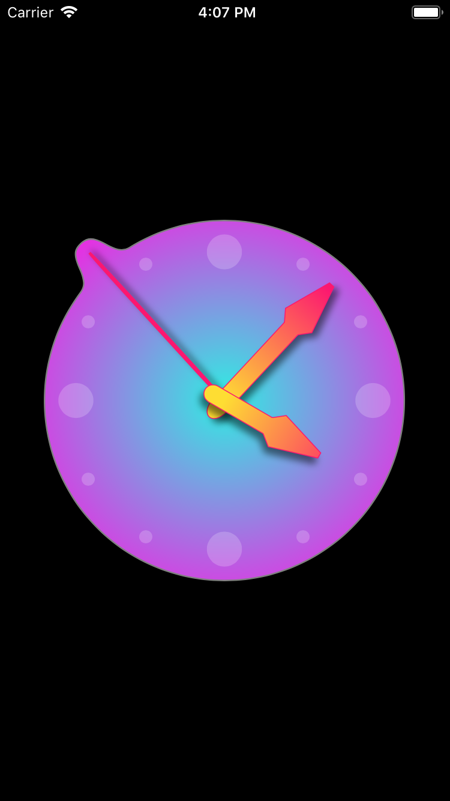

# Clocknator #

A simple analog clock inspired by the [Vectornator app][vectornator].

The clock is implemented by the [`ClocknatorView`][ClocknatorView.swift] class.

## Screenshot ##

[vectornator]: https://vectornator.io

[ClocknatorView.swift]: https://github.com/pmattos/Clocknator/blob/master/Clocknator/ClocknatorView.swift
